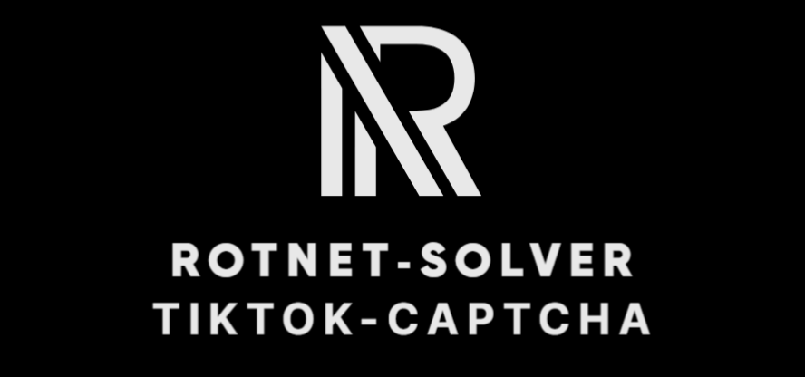
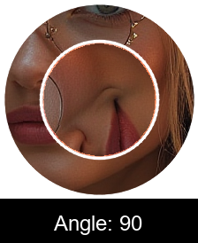
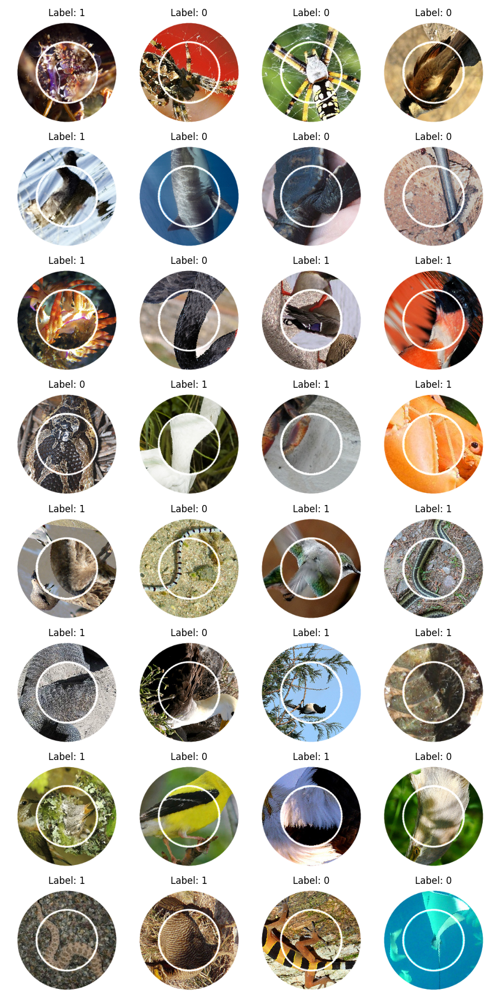
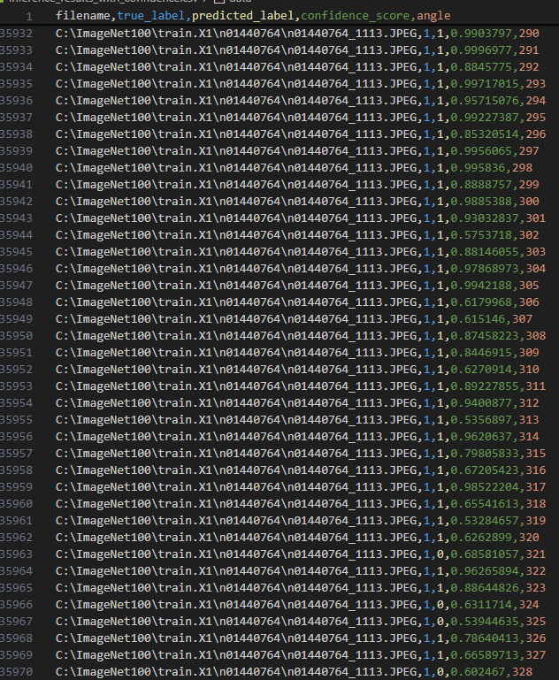
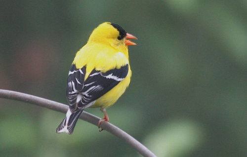
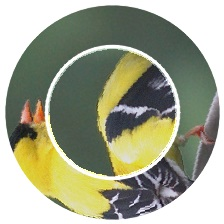
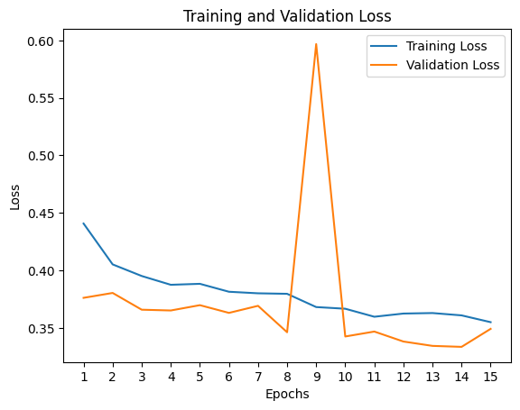
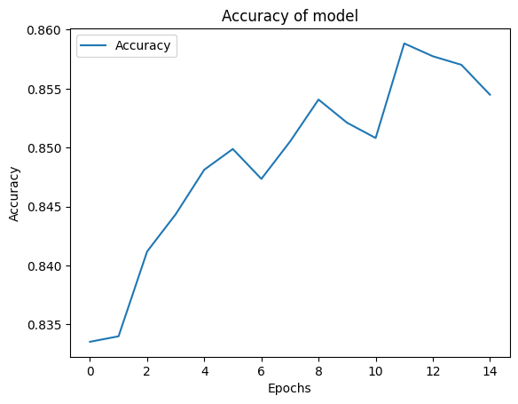
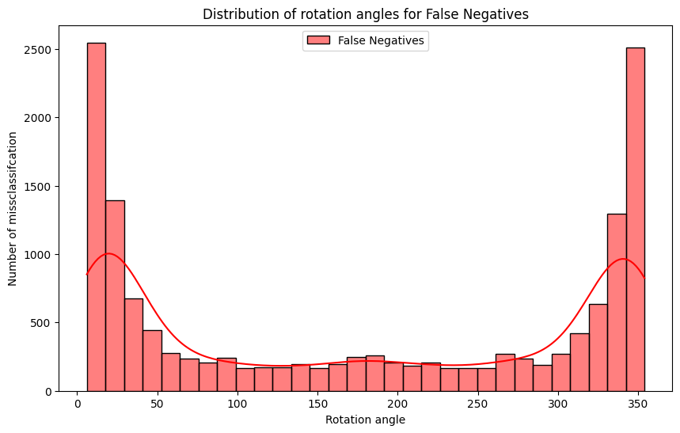
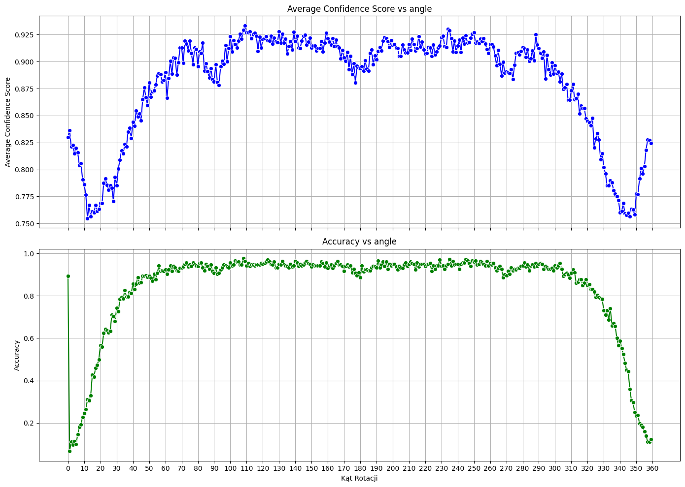

> Neural netwrok and statistical analysis for solving TikTok captcha (NOT FINISHED)




## 🚩 Table of Contents

- [Environment](#-environment)
- [Features](#-features)
- [Examples](#-examples)
- [Pipeline explained](#-pipeline-explained)
- [Changes](#-changes)
- [TODO](#-todo)
- [License](#-license)


## 📦 Environment

### Python version and libraries

| Version | Info |
| --- | --- |
|Python 3.11.7 | Jupyterlab code |

### Main libraries used in project

| Name | Description |
| --- | --- |
| numpy | Tensors |
| torch torchvision | Uses cuda 124 |
| pandas | Dataframes |
| sklearn | EDA and thershold |
| matplotlib | Visualize charts |
| PIL, opencv | Image preprocessing |


> For more info look at requirements.txt and torch_version.txt


## 🎨 Features

### 🤖 What is RotNet captcha solver?
It is a prototype of a tool focused on solving captcha. Whether you're looking to preprocess images, build neural networks, train them or make EDA of output tool has got you covered. Future updates will introduce advanced features such as real time worker with selenium and better performance.

Available now:
* Image preprocessing
* Different model builder and trainer (even vision-transformers) 
* EDA of network output


## 🐾 Examples

### Preprocessing of images
This section provides an example output demonstrating the preprocessed images.

* Image examples



* Output data 




### Actually available models: EfficientNetb3, Resnet(any), SwinV2T


## 🌏 Pipeline explained

### INPUT
> Data on which model was trained is subset of ImageNet 


### Files
| File | desc |
| --- | --- |
|1. RotNetDataGenerator.ipynb | Old version
|2. RotNetSecondVersion.ipynb| Actual version


### Process
* Just look at files


### Output
For any given image, after preprocessing, there is **classification** pred if it was rotated


## 🔧 Changes

### Things improved in comparison to first version

1. Accuracy - By using EfficientNetb3 and more complex classificator head accuracy improved from 78 to 85 % (Without fine-tuning)
2. Cod is refactored, easier to read and all in english
3. Problem with bad color channels resolved 
4. Model was trained using much more data over 100k images
5. Possibility of using vision transofmrers 
6. Faster inference 
7. EDA of output in order to better understand limitations and path of development
8. Explained way of how to use it with selenium


## 📈 Result
```
First test model was trained with ResNet-18 and got:
* HIGHREST ACCURACY: 0.7892497518082542

Newest model was trained on Efficentnet and got:
* HIGHREST ACCURACY: ~ 85%
```

0. ### Example image


1. ### Preprocessed Image

Angle = 90

3. ### Train/Test loss


4. ### Accuracy of model



## 💬 TODO

* Real time solver with selenium
* Augumentation like little distortion in image




* Looking at EDA (look at code for more info) it seems to be reasonable to have 2 networks one small which will in general classify stuff and second which will be responsible in looking only on very hard examples. Or something like this. For sure there is some paper which resolved similiar issue
* Make finetuning with W&B - easy improvement 
* Train with different models
* **The way it is trained can be improved** by other function loss and way model is feeded with data, after initial training it could be best to train it further only on very hard examples something like online-mining in FaceNet? (looking at loss and confidence score)


## 📜 License

This software is licensed under the [MIT](https://github.com/nhn/tui.editor/blob/master/LICENSE) © [NHN Cloud](https://github.com/nhn).

