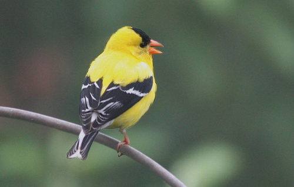
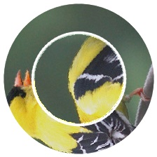
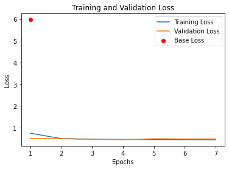
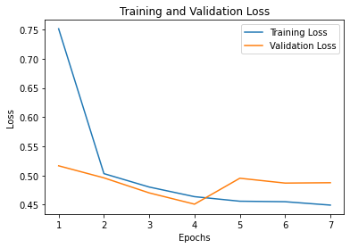
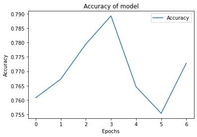

# CNN for solving TikTok captcha (NOT FINISHED)

## Train Pipeline
```bash
1. Get a lot of data e.g Imagenet
2. Create Function for online(during training) generating Data
3. Use some CNN as Feature extractor
4. Train classifier

Classify as 0 - no angle rotate
            1 - image rotated

Classifier with 360 labels does not work

```

## Result
```
First test model was trained with ResNet-18 and got:
* HIGHREST ACCURACY: 0.7892497518082542
```

0. ### Example image


1. ### Preprocessed Image

Angle = 90

2. ### Base Loss


3. ### Train/Test loss


4. ### Accuracy of model



Repo uses resources from:

https://github.com/DFGANDP/Pytorch-EarlyStopping

## Currently TODO:
1. Train on more Data
2. Use more complex models (e.g. Vision Transformers)
3. Write Real Time solver With Selenium?
